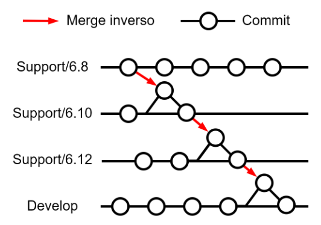

# P.071 - Producción del "Design Data"

## 1. Objeto y alcance

Este documento describe el procedimiento para producir los datos de diseño (Design Data en ARP/DOs) del día a día. Por ejemplo: código fuente, circuitos impresos, dibujos en 3D, test cases, documentos, etc.

Todos estos datos se organizarán en **repositorios** propiedad de Embention en su espacio dentro de [GitHub](https://github.com/embention/) siguiendo el procedimiento
[P.073 - Organización del Design Data](https://documentation.embention.net/073/es/latest/index.html).

## 2. Descripción de actividades

El procedimiento a seguir es el siguiente:

#### 1.  **Recepción de Tarea**

Las tareas nacen en los proyectos. Un producto se irá desarrollando también en el marco de proyectos. Los proyectos tienen un responsable que se encargará de desglosar en tareas su ejecución.

Los responsables de los proyectos se coordinarán con el responsable de tu departamento quien será el que te asigne una tarea cuyo objetivo es la producción de Design Data.

#### 2.  **Localización de Issue**

Cada tarea encomendada estará materializada en al menos un Issue de GitHub. Lo primero que hay que hacer antes de nada es localizar el Issue de GitHub para el que vamos a trabajar.

Si se te ha asignado una tarea y aún no existe un Issue, tendrás que crearlo. Puedes ver cómo crear un Issue en [P.062 - Creación de Issue](https://documentation.embention.net/062/es/latest/index.html).

Una vez tienes un Issue tienes que asegurarte de que está bien definido y entiendes sus  bjetivos. En este punto ya deberías estar cargando tus horas de trabajo en él (ver [P.072 - Carga de Horas](https://documentation.embention.net/072/es/latest/index.html))

> [!IMPORTANT]
>
> En el momento que empezamos a trabajar en esta tarea la pipeline y el estado del o los  proyectos de la issue asociada tienen que pasar a "In progress"

#### 3.  **Selección de Rama "support"**

Si la rama no existe, es necesario generarla previamente según el procedimiento de [P.471 - Generación de ramas support](https://documentation.embention.net/471/es/latest/index.html).
Una nueva rama siempre partirá de la rama con una versión anterior: develop para los casos en los que pueda haber versiones inestables o en desarrollo y support para el resto.

En función de las tareas definidas en la issue asignada se seleccionará una de las ramas support existentes. Cada rama support es independiente del resto y está orientada a trabajar exclusivamente con un grupo concreto de ítems y, consecuentemente, con unos equipos en concreto. Los equipos/ítems existentes son:

-   sw (Firmware, GNC, Veronte APPS, Software Verification)
-   hw (Product, Avionics, Design, Hardware Verification)
-   docs (Scripts)

La nomenclatura empleada para las ramas support será la siguiente salvo para develop:

-   support/\[equipo/ítem\]/\[versión\]

Ejemplos de ramas:

-   develop
-   support/sw/6.14
-   support/hw/4.10
-   support/sw_docs/6.14
-   support/hw_docs/4.10

> [!NOTE]
>
> Los procedimientos de producción y los ATP, a pesar de ser documentos, se almacenan en ramas support/hw/XX (siendo XX la versión de hardware).

#### 4.  **Apertura de Rama "feature"**

En muchos casos, en este punto deberás abrir una o varias ramas en uno o más repos. Podría ser que este Issue en concreto no necesite la apertura de una rama y que se pueda resolver, por ejemplo, con un comentario en el propio Issue, etc. Si no es necesaria una rama, salta al siguiente paso.

Para abrir una rama en un repositorio sigue los siguientes pasos dentro de SmartGit o Sourcetree:

-   Clonado (si aún no lo tienes puedes ver [P.070 - Clonado de repositorios](https://documentation.embention.net/070/es/latest/index.html))
-   Selección de rama develop
-   **Add branch**:

El nombre de la rama dependerá de si la **issue** a ejecutar está en el mismo repositorio que la rama o no:

-   **Rama en el mismo repositorio que la issue**:
    `feature/xxxx_short_title`
-   **Rama en diferente repositorio que la issue**:
    `feature/nombre_repo/xxxx_short_title`

Siendo:

-   `xxxx` el ID del Issue en el que trabajas.
-   `short_title` el título del Issue o un par de palabras que permita identificar la rama a  tu compañer@s sin tener que perder tiempo buscando en GitHub.
-   `nombre_repo` el nombre del repositorio donde se encuentre la issue.

#### 5.  **Commit**

Los **Commits** se consideran artefactos de desarrollo que contienen todos los archivos creados o modificados desde el estado anterior del repositorio.

**"Commitear"** es el procedimiento por el cual los miembros del equipo reconocen alguna tarea definida por un **"Issue de Github"** dado. Por lo tanto, los **"Commits"** y las **"Issues de Github"** se vincularán en el momento de la confirmación insertando el enlace al principio del comentario del **"Commit"** seguido de un espacio en blanco y el comentario corto en inglés que explique que sucede en el **"Commit"** y si se necesita una explicación más extensa acontinuación se hará un doble salto de linea y se incluirá la explicación exntendida, esta explicación extendida podrá estar en otro idioma diferente al inglés.

Por ejemplo, si el commit contiene los cambios de la issue nº **"55"** del repositorio **"Veronte"** de la organización de GitHub **"Embention"** el mensaje de commit con explicación extendida quedaría del siguiente modo.

``` MD
embention/Veronte#55 Short Explanation

Explicación extendida linea 1
Explicación extendida linea 2
Explicación extendida linea 3
```

#### 6.  **Producción de Design Data**

Cada Issue llevará al menos 3 etiquetas:

-   Departamento que lo lleva a cabo (etiqueta azul)
-   **Dónde** se va a almacenar el Design Data (etiqueta verde)
    -   Comment, para más información léase [P.061 - Comentar Issue](https://documentation.embention.net/061/es/latest/index.html).
    -   Commit.
    -   Release, para más información, léase [P.081 - Release item](https://documentation.embention.net/081/es/latest/index.html).
-   Tipo de Design Data que se espera obtener (etiqueta naranja):
    -   Analysis
    -   Artifacts
    -   Code
    -   docs
    -   Release

En este punto ya habrás producido el Design Data.

A continuación vienen los pasos de revisión y cierre. Estos pasos dependen de la etiqueta verde (Comment, Commit o Release) del Issue, por lo que los siguientes pasos serán de aplicación en función de esta etiqueta.

En el caso de **Comment** y **Release** puedes saltar directamente al último paso (9. Cierre de Issue).

#### 7.  **Revisión Commit**

   En el caso de haber realizado algún commit serán necesarios los siguientes pasos:

   1.  **Creación de Pull-Request**

       Antes de dar por terminada la tarea, el Design Data almacenado en repos mediante commits deberá ser revisado con independencia, es decir, por al menos una persona diferente.

       Según el tipo de Design Data y el Departamento, la revisión se podrá centrar en distintos aspectos.

       A pesar de que la revisión la haga otra persona, tú, como autor del Design Data, llegarás a este punto habiendo realizado tus propias revisiones, tests, etc.

       Para que las otras personas puedan hacer la revisión, es necesario que crees un **Pull-Request**. Puedes ver cómo crear un Pull-Request en [P.063 - Creación de Pull-Request](https://documentation.embention.net/063/es/latest/index.html).

   2.  **Espera activa**

       Después de crear un Pull-Request, deberás perseguir su revisión, es decir, tú eres el encargado de que el Design Data acabe en develop por lo que deberás estar pendiente de la ejecución de la revisión por parte de tus compañer@s.

   3.  **Merge**

       Una vez que tu(s) compañer@(s) realicen la revisión y soliciten las aclaraciones y/o modificaciones necesarias, estarás en condiciones de realizar un merge a develop.

       Para realizar el merge, sigue el [P.067 - Merge](https://documentation.embention.net/067/es/latest/index.html).

   4.  **Borrado de Rama**

       GitHub eliminará de forma automática la rama una vez haya sido mergeada. No hay problema porque si en el futuro quieres rescatar esta rama, será posible realizarlo.

#### 8.  **Merge en cascada**

Una vez que los cambios han sido aprobados y mergeados se deben propagar cuandocorresponda a las ramas superiores. Por ejemplo, si se resuelve un bug en support/sw/6.14 habría que hacer un merge en cascada a las ramas support/sw/6.16 y a develop. Para ello,se procede la siguiente manera:

   1.  Se crea una issue para llevar a cabo la tarea indicando que se trata de un merge encascada y desde dónde y hacia dónde se van a propagar los cambios. Por ejemplo: "Cascading merge 6.8 6.12 6.14 dev".
   2.  Se saca una rama "feature" de la rama support destino, por ejemplo: se saca de "support/sw/6.12" >> "feature/XXXX_cascading_merge_6.8_6.12".
   3.  Se mergea la rama "support" origen, donde se encuentran los cambios ya implementados,en la rama "feature" creada.
   4.  Tras resolver los conflictos si los hubiera, se pushean los cambios, se crea una nueva pull request para que sean revisados y aprobados y se mergean en la rama "support" destino.
   5.  Repetir los pasos anteriores para propagar los cambios hasta la última rama deseada.

   <figure align='center'>
   
   <figcaption><strong>Ejemplo de merge en cascada</strong></figcaption>
   </figure>

Los merges en cascada se llevarán a cabo **inmediatamente** tras mergear la rama "feature" a su rama origen.

#### 9.  **Cierre de Issue**

La tarea no se dará por concluida hasta que no se cierre el Issue que la originó.

Puedes ver cómo cerrar un Issue en [P.453 - Cerrar Issue](https://documentation.embention.net/453/es/latest/index.html). Si el destino del Design Data es un (o varios) el Issue podrá cerrarse de manera automática al incluir en el comentario del commit o Pull-Request la palabra *close* o *closes* embention/Embention#xxxx).

Si haces esto, asegúrate que no hay que hacer nada más para terminar la tarea. Esta  característica de GitHub puede agilizar el trabajo pero hacerlo de un modo inadecuado podría provocar olvidar nuevas tareas o bloqueos en otras existentes.
